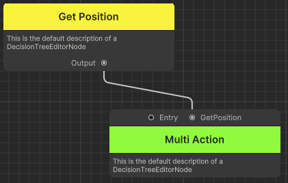
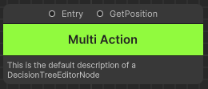

# Advanced Node Creation

Currently the samples provide some very basic nodes that can be plugged into the decision tree. But did you know that you can provide function nodes to action nodes as well? Lets look at how this works.

All nodes contain a constructor and must contain a default constructor which is used in the creation and adding off nodes to the tree. Take this basic node below that has a default constructor:

```c#
class ABasicAction : Action 
{
    public ABasicAction() : base()
    {
        // A default constructor
    }
}
```

If you want your node to take additional function parameters you can create an additional constructor that takes these like so:

```c#
class ABasicAction : Action 
{
    // A reference to the function node
    Function<Vector2> GetPosition { get; set; }

    public ABasicAction() : base()
    {
        // A default constructor
    }

    public ABasicAction(Function<Vector2> GetPosition) : base()
    {
        // A custom constructor
    }
}
```

This will tell the visual editor to create a node with another input port of type `Function<Vector2>`. This means that you can plug in any other function node which has the return type of Vector2. Also note that the name of the parameter will also be the label of the input port of the node.

You will also need to store a reference to the function node so you can call it later in the execute function. The reference is very flexible, it can be either a field or a property and have any access modifier you want on it. The only restriction is the name of the parameter in the constructor should match exactly to the name of the reference.

Now since this node technically has another child, we need to update our clone, initialise & get children functions to include this new node. These a rather simple by:

```c#
public override void Initialise<T>(T metaData)
{
    base.Initialise(metaData);
    GetPosition.Initialise(metaData);   // Initialise our GetPosition with metaData also
}

public override DecisionTreeEditorNodeBase Clone()
{
    // Make sure we clone our GetPosition
    MultiAction clone = Instantiate(this);
    clone.GetPosition = (Function<Vector2>)GetPosition.Clone(); // Clone has to be explicitly cast to the type we want since it cannot be infered.
    return clone;
}

public override List<DecisionTreeEditorNodeBase> GetChildren()
{
    return new List<DecisionTreeEditorNodeBase>() { GetPosition };  // Return our GetPosition as a child of this node
}
```

Once all this is setup you should be able to create your new node and see the new input on the top of the node as shown below



We can then invoke this function node inside the action's execute function like so:

```c#
public override IEnumerator Execute()
{
    Debug.Log(GetPosition.Invoke());
    yield return null;
}
```

Now all thats left is for you to create a function node that returns the type that matches with the function node reference and link them inside the tree. You can run the tree on the DTRunner to test if the additional input function node works.