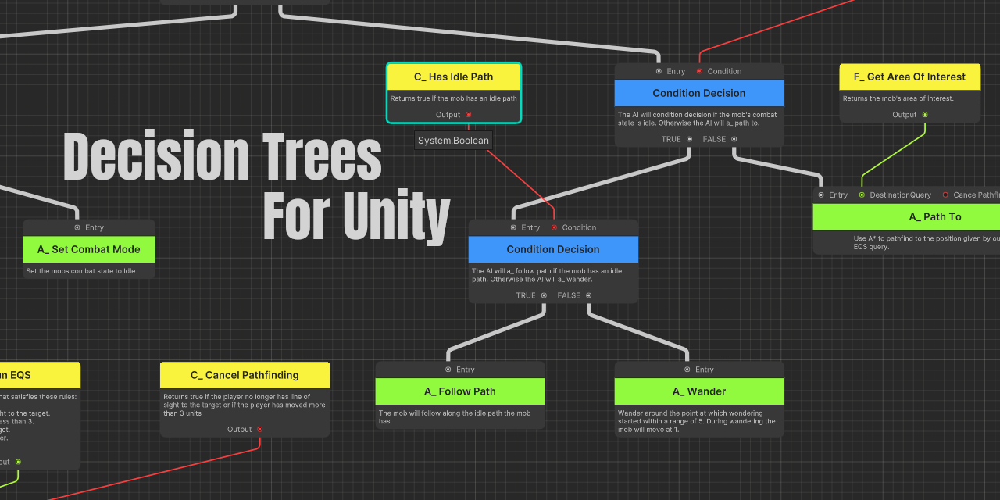
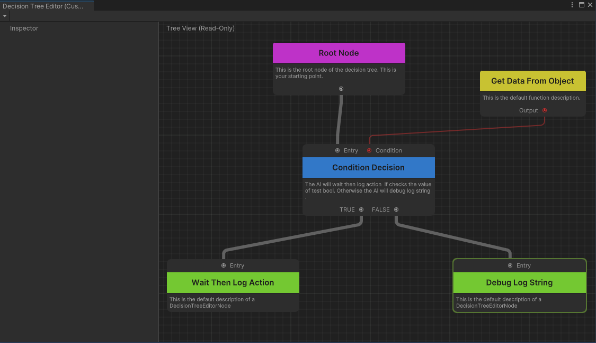
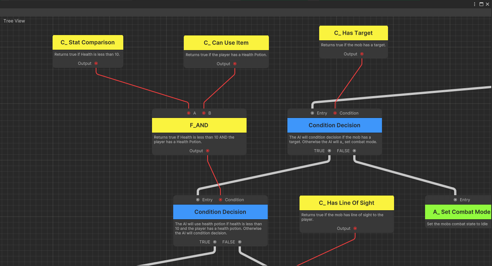
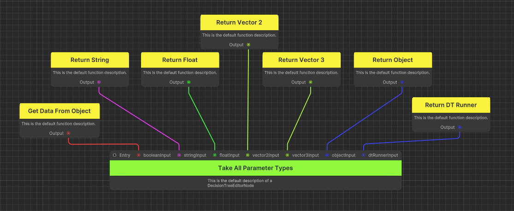

# Decision-Tree-Package

A Unity package containing creating and editing decision trees. Including the decision tree visual editor.

## Features

### Run-time Visualisation


The visual editor supports runtime visualisation where you can monitor individual trees at runtime and see which actions they are currently executing and have executed. This does require a small bit of setup but that is fully covered in the [documentation](Documentation~/RuntimeVisualisation.md) of this package.

### Procedural Descriptions & Titles


The visual editor will also include any descriptions you may include by overriding the `GetDescription` and `GetSummary` functions. This can help you keep track of what your nodes do at a glance without having to view the fields you have set on the node.

### Real-time Erroring


The visual editor also provides errors to you in real time. Since the `GetDescription` and `GetSummary` functions are called in editor, you can attach `try-catch` statements and check for null values in your node. You can then assign error messages to the node view's error property and have them display in the editor!

### Full Flexibility


Sometimes you need a node that can take other nodes as parameters. This visual editor allows you to add as many parameter nodes to your node that you want. How to do this is outlined in the [documentation](Documentation~/AdvancedNodeCreation.md).

### Built-in Action Manager

This package also contains a built in action manager. This is a component that you can add to your AI and it will handle executing through the action queue and running it on the AI that it is attached to through coroutines

### Sample Assets

The package contains some sample assets to help you understand how to use this package in your project. Be sure to check it out with the unity package manager and read through the heavily commented sample scripts.

## How to Install

There are three methods of installing this package: downloading manually, downloading with git url or downloading by name.

### Download Manually
To download manually you can:
- Clone this repository locally along with this packages dependencies([generic-helpers](https://github.com/KieranCoppins/Generic-Helpers)).
- Open the package manager in Unity
- Click the "+" icon and click to add package from disk
- Click this repository that you have cloned

You should then see this package in your package manager

### Download with GitURL
To download with GitURL also requires you to download dependencies locally. [Currently Unity doesn't support git dependencies with git packages](https://forum.unity.com/threads/custom-package-with-git-dependencies.628390/). This means that you need to make sure you install [generic-helpers](https://github.com/KieranCoppins/Generic-Helpers) first.

To install with a GitURL you simply:
- Open the Unity package manager
- Click the "+" icon and click to add package from git URL
- Paste the clone link for this repository (`https://github.com/KieranCoppins/Decision-Tree-Package.git`)

**Remember**: do the same with the generic helpers dependancy.

### Download by Name
To download by name requires a bit of setup. Effectively, I am going to be re-iterating is from this [forum post](https://forum.unity.com/threads/using-github-packages-registry-with-unity-package-manager.861076/) from step 4.

- First, you need to [log in to the git registry using a personal access token (PAK)](https://docs.github.com/en/packages/working-with-a-github-packages-registry/working-with-the-npm-registry#authenticating-with-a-personal-access-token). This requires npm to be installed and make sure your PAK has `packages:read` permissions. You can do this by running the command: `npm login --scope=@<your-github-username> --registry=https://npm.pkg.github.com` and entering your github username, PAK for password, and your email.

- Next, you will need to do what is discussed [here](https://forum.unity.com/threads/npm-registry-authentication.836308/). This access token should then get placed into the `.npmrc` file inside your user's root (For Windows this would be `C:/Users/<user>/.npmrc`). Then inside this same user root location you need to create a `.upmconfig.toml`. The contents of this file should be:
    ```
    [npmAuth."https://npm.pkg.github.com/@<your-github-username>"]

    token = "<AUTH TOKEN  _authToken in .npmrc)>"

    email = "<EMAIL>"

    alwaysAuth = true
    ```

- Next, you need to add a scoped registry to your project's package manifest. This is locked in `<project-root>/Packages/manifest.json`. The scoped registry is:
    ```json
    "scopedRegistries": [
        {
            "name": "Github Packages",
            "url": "https://npm.pkg.github.com/@<your-github-username>",
            "scopes": [
                "com.kierancoppins"
            ]
        }
    ]
    ```
    **Note**: You can also add other git packages here too, so if by chance you already have some git packages you can just add `com.kierancoppins` to your git packages scope.

- You can then choose to add the package to this json by adding `"com.kierancoppins.decision-trees": "^1.0.3"` to the dependencies object of the json OR by going into the unity package manager and:
  - Click the "+" icon and click to add package by name
  - Enter: `com.kierancoppins.decision-trees`. You can also specify a version name, otherwise it will get the latest.

The benefit from doing this is that it's very easy to update this package once its setup. Since dependencies will be downloaded automatically, it allows to use the package manager to update this package.